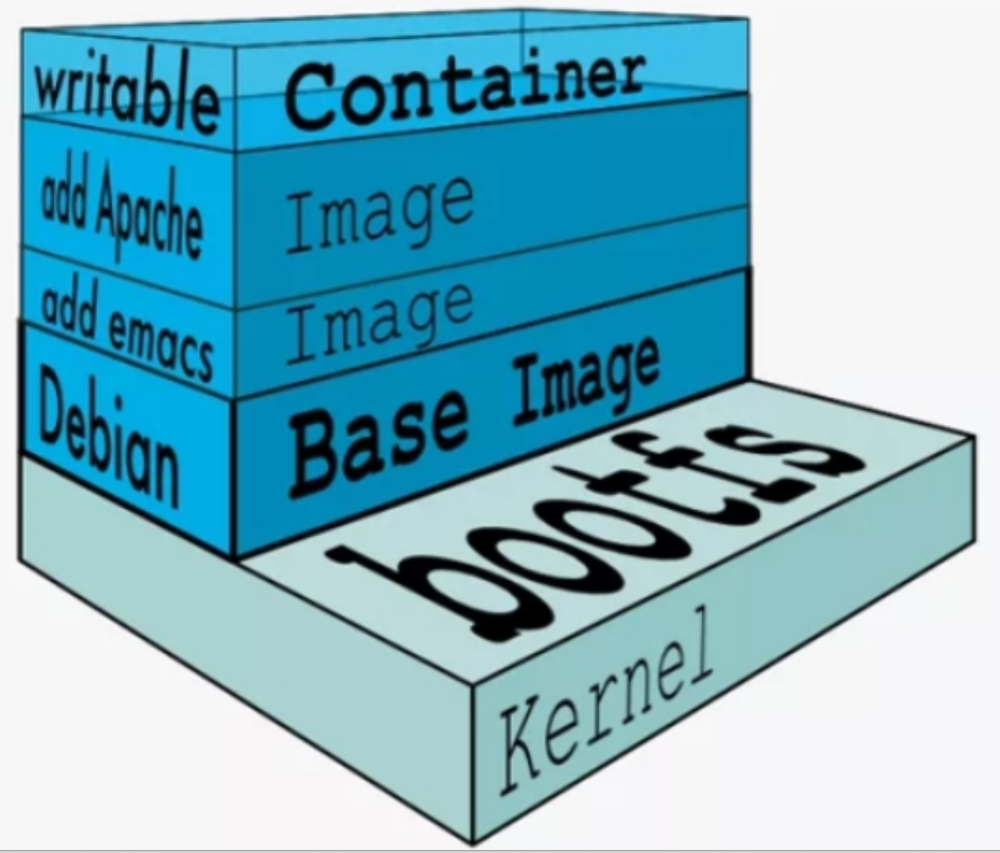

## Docker

### 1.Docker概念

Docker 是一个**开源的平台**，我们**可以用 Docker 来开发、部署和运行我们的应用程序**。Docker 可以帮助我们**将应用程序和底层基础设施进行分离，以帮助我们更快的实现交付**。通过 Docker 技术，我们可以像管理我们的应用一样管理我们的基础设施（比如操作系统、依赖的开发包等）。通过 Docker 技术，可以精简我们的整个开发和交互流程。

Docker 是一种轻量级的虚拟化技术，目的和虚拟机一样，都是为了创造“隔离环境”。但是它不像 VM 采用操作系统级的资源隔离，容器采用的是进程级的系统隔离。


Docker 容器具有以下三大特点：

- 轻量化：一台主机上运行的多个 Docker 容器可以共享主机操作系统内核；启动迅速，只需占用很少的计算和内存资源。
- 标准开放：Docker 容器基于开放式标准，能够在所有主流 Linux 版本、Microsoft Windows 以及包括 VM、裸机服务器和云在内的任何基础设施上运行。
- 安全可靠：Docker 赋予应用的隔离性不仅限于彼此隔离，还独立于底层的基础设施。Docker 默认提供最强的隔离，因此应用出现问题，也只是单个容器的问题，而不会波及到整台主机

> Docker 其实是一个**轻量级的虚拟化技术**。**Docker 可以让开发者在构建应用时，将应用与其依赖的环境一起打包到一个可移植的容器中**, 然后很方便地发布到任意操作系统中

(1)Docker Client :Docker Client 通过命令用于和 Docker Daemon 交互

(2)Docker Daemon 是一个 Docker 后台运行的守护进程

启动 Docker daemon 可以通过如下命令：

```bash
service docker start
或
systemctl start docker.service
```

启动成功后，通过 <code>ps</code>命令即可看到 docker daemon 进程：

```bash
ps aux | grep dockerd
```

(3)Docker Registry:Registry 意为**注册中心**，它是**用来存储 Docker 镜像的地方**，后续我们下载镜像都会从注册中心下载

(4)Docker Images:Docker 镜像可以理解为**存于磁盘上面可以通过特定方式执行的静态文件**，可以类比传统虚拟机中的 ISO 文件。（Docker 镜像是可以被 Docker Daemon 识别并执行的特定文件）

(5)Docker Container:容器

> **容器是镜像的运行实例**

**K8s和docker**

> k8s 和 Docker 并不是一个维度的东西，不具有可比性。它们之间是相互依存的关系，Docker 是容器引擎，而 k8s 是用来编排 Docker 等容器的协调器

### 2.Docker镜像

**Docker 镜像是一个特殊的文件系统**，除了提供容器运行时所需的程序、库、资源、配置等文件外，还包含了一些为运行时准备的一些配置参数（如匿名卷、环境变量、用户等）。镜像不包含任何动态数据，其内容在构建之后也不会被改变

镜像包含操作系统完整的 <code>root</code> 文件系统，往往体积比较大。镜像并不只是一个虚拟的概念，其体现并非由一个文件组成，而是一系列的文件系统组成。因此，采用分层存储，并且如果删除前一层文件的操作，实际上并不是删除前一层的文件，而是把当前层的文件标记为删除。并且分层存储的好处是复用和定制化，既可以复用镜像，也可以添加新的分层定制自己所需的内容。

（1）搜索镜像

```bash
docker search [option] keyword

eg:docker search mysql

option:--help,-f,--limit

```

（2）下载镜像

```bash
docker pull [IMAGE_NAME]:[TAG]
docker pull --help
```

（3）查看镜像

```bash
docker images ls
docker inspect [IMAGE_NAME]:[TAG] --查看镜像的详细信息，返回json数据
docker inspect -f {{".Size"}} mysql:5.7 -f可以指定某一个字段
docker history mysql:5.7       --查看镜像每个层的创建信息
docker history --no-trunc mysql:5.7  --完整版的具体信息
```

（4）导出镜像

```bash
docker save -o redis.tar redis:latest        --save可以导出Docker镜像
docker load -i redis.tar             --load命令导入镜像
```

（5）删除镜像

```bash
docker rmi [imageId]      --建议直接通过镜像ID进行删除，一个镜像可能有多个版本
docker image prune     --清理没用的镜像文件，-a删除所有没有被使用的 -f强制删除
```

### 3.Docker容器

通过镜像运行的实例为容器，Docker利用容器运行应用，每个容器都是相互隔离的，可以把容器看作是一个轻量级的Linux运行环境

容器的实质是进程，但与直接在宿主执行的进程不同，容器进程运行于属于自己的独立的命名空间。因此容器可以拥有自己的 <code>root</code> 文件系统、自己的网络配置、自己的进程空间，甚至自己的用户 ID 空间。容器内的进程是运行在一个隔离的环境里，使用起来，就好像是在一个独立于宿主的系统下操作一样。


镜像使用的是分层存储，容器也是如此。每一个容器运行时，是以镜像为基础层，在其上创建一个当前容器的存储层，我们可以称这个为容器运行时读写而准备的存储层为**容器存储层**,随着容器的销毁，容器存储层也会销毁

（1）查看容器

```bash
docker ps           --查看运行中的容器
docker ps -a        --查看所有容器
docker ps -l        --查看最新的容器，只列出最后创建的容器
docker ps -n=2: -n=2 --查看最新创建的两个容器
```

（2）启动容器

```bash
新创建容器：
docker run
					-name  设置容器名
					-itd  t表示交互式，i表示容器输入打开，d表示容器后台运行以 daemon 守护态方式运行容器


启动已有的容器：docker container start [container ID or NAMES]

docker container logs [container ID or NAMES]    查看日志

```

（3）进入容器

```bash
docker exec -it [container ID or NAMES] bash
docker attach [container ID or NAMES]       attch进入容器exit退出后，容器也会停止

停止容器：
docker stop [container ID or NAMES]
docker kill [container ID or NAMES] 强制关闭容器

重启容器：
docker restart -t=5 [container ID or NAMES]  -t : 设置关闭容器的限制时间，若超时未能关闭，则使用 kill 命令强制关闭，默认值为 10s，这个时间用于容器保存自己的状态

删除容器
docker rm -f [container ID ]
```

（4）导入导出容器

```bash
docker export [container ID] > name.tar
cat redis.tar | docker import - test/redis:v1.0   使用 docker import 命令可以将快照导入为镜像
docker import http://example.com/exampleimage.tgz example/imagerepo  除了通过快照的方式导入容器，还可以通过指定 URL 或者某个目录来导入
```

### 4.Docker仓库

一个仓库会包含同一个软件不同版本的镜像，而标签就常用于对应该软件的各个版本。我们可以通过 <code><仓库名>:<标签></code>

通俗一点讲，其实就是和Linux下载的源仓库是一个概念，仓库可以存储不同的源，通过源我们可以去拉镜像；与此同时也可以自己去指定专门的镜像源。**仓库名通常以两段式路径形式出现，比如jwilder/nginx-proxy**

国内从DockerHub拉取镜像，网络相对较慢，可以去配置国内源，和Linux的仓库本质上是一个概念。

### 5.Docker数据管理

**数据卷是一个可供一个或多个容器使用的特殊目录，用于持久化数据以及共享容器间的数据，它以正常的文件或目录的形式存在于宿主机上。** 另外，其生命周期独立于容器的生命周期，即当你删除容器时，数据卷并不会被删除

（1）volume

volume : Docker 管理宿主机文件系统的一部分，默认位于 <code>/var/lib/docker/volumes</code> 目录下, 也是最常用的方式


所有的 Docker 容器数据都保存在 <code>/var/lib/docker/volumes</code> 目录下。若容器运行时未指定数据卷， Docker 创建容器时会使用默认的匿名卷（名称为一堆很长的 ID）

```bash
1.创建数据卷
docker volume create test-vol
2.查看所有的数据卷
docker volume ls
3.查看数据卷信息
docker volume inspect test-vol
4.运行容器时挂载数据卷
docker run -d -it --name=test-nginx -p 8011:80 -v test-vol:/usr/share/nginx/html nginx:1.13.12
docker run -d -it --name=test-nginx -p 8011:80 --mount source=test-vol,target=/usr/share/nginx/html nginx:1.13.12
使用 -v 挂载时，如果宿主机上没有指定文件不会报错，会自动创建指定文件；当使用 --mount时，如果宿主机中没有这个文件会报错找不到指定文件，不会自动创建指定文件
5.删除数据卷
docker volume rm test-vol
```

（2）bind mount

bind mount: 意为可以存储在宿主机中的任意位置。需要注意的是，bind mount 在不同的宿主机系统时不可移植的，比如 Windows 和 Linux 的目录结构是不一样的，bind mount 所指向的 host 目录也不一样。这也是为什么 bind mount 不能出现在 Dockerfile 中的原因所在，因为这样 Dockerfile 就不可移植了

```bash
docker run -d -it --name=test-nginx -p 8011:80 -v /docker/nginx1:/usr/share/nginx/html nginx:1.13.12
与 volume 不同，bind mount 这种方式会隐藏目录中的内容（非空情况下）
```

##### 创建数据卷容器

##### **数据卷容器，其实就是一个正常的 Docker 容器，专门用于提供数据卷供其他容器挂载的**。

```bash
docker run -d -v /dbdata --name dbdata training/postgres echo Data-only container for postgres
```

##### 挂载数据卷

```bash
--volumes-from 命令支持从另一个容器挂载容器中已创建好的数据卷
docker run -d --volumes-from dbdata --name db1 training/postgres
docker run -d --volumes-from dbdata --name db2 training/postgres
docker ps
CONTAINER ID       IMAGE                COMMAND                CREATED             STATUS              PORTS               NAMES
7348cb189292       training/postgres    "/docker-entrypoint.   11 seconds ago      Up 10 seconds       5432/tcp            db2
a262c79688e8       training/postgres    "/docker-entrypoint.   33 seconds ago      Up 32 seconds       5432/tcp            db1

```

如果删除了挂载的容器（包括 dbdata、db1 和 db2），数据卷并不会被自动删除。如果想要删除一个数据卷，必须在删除最后一个还挂载着它的容器时使用 <code>docker rm -v</code> 命令来指定同时删除关联的容器

##### 备份

容器启动后，使用了 <code>tar</code> 命令来将 dbdata 数据卷备份为容器中 /backup/backup.tar 文件，因为挂载了的关系，宿主机的当前目录下也会生成 <code>backup.tar</code> 备份文件

```bash
sudo docker run --volumes-from dbdata -v $(pwd):/backup ubuntu tar cvf /backup/backup.tar /dbdata
```

##### 恢复/迁移

如果要恢复数据到一个容器，首先创建一个带有空数据卷的容器 dbdata2

```bash
sudo docker run -v /dbdata --name dbdata2 ubuntu /bin/bash
```

然后创建另一个容器，挂载 dbdata2 容器卷中的数据卷，并使用 <code>tar</code> 解压备份文件到挂载的容器卷中

```bash
sudo docker run --volumes-from dbdata2 -v $(pwd):/backup busybox tar xvf
/backup/backup.tar
```

为了查看/验证恢复的数据，可以再启动一个容器挂载同样的容器卷来查看

```bash
sudo docker run --volumes-from dbdata2 busybox /bin/ls /dbdata
```

### 6.Dockerfile

Dockerfile 可以清楚的看到镜像每一层的构建指令，从而判断该镜像是否安全可靠

通过 Dockerfile 构建镜像时，如果发现本地存在可以重复利用的 layer，就不会重复下载，这样可以节省存储空间



#### 制作镜像

编辑 <code>Dockerfile</code>

```bash
FROM nginx
RUN echo '<h1>Hello, Nginx by Docker!</h1>' > /usr/share/nginx/html/index.html
```

通过 **<code>FROM</code>指令可以指定基础镜像**，在 Dockerfile 中，<code>FROM</code> 是必备指令，且必须是第一条指令。比如，上面编写的 Dockerfile 文件第一行就是 <code>FROM nginx</code>, 表示后续操作都是基于 Ngnix 镜像之上

常情况下，基础镜像在 DockerHub 都能找到，如：

- **中间件相关**：<code>nginx</code>、<code>kafka</code>、<code>mongodb</code>、<code>redis</code>、<code>tomcat</code> 等；
- **开发语言环境** ：<code>openjdk</code>、<code>python</code>、<code>golang</code> 等；
- **操作系统**：<code>centos</code> 、<code>alpine</code> 、<code>ubuntu</code> 等；

除了这些常用的基础镜像外，还有个比较特殊的镜像 : <code>scratch</code> 。它表示一个空白的镜像

##### RUN 执行命令

<code>RUN</code> 指令用于执行终端操作的 shell 命令，另外，<code>RUN</code> 指令也是编写 Dockerfile 最常用的指令之一。它支持的格式有如下两种：

- **1、<code>shell</code> 格式**: <code>RUN <命令></code>，这种格式好比在命令行中输入的命令一样。举个栗子，上面编写的 Dockerfile 中的 <code>RUN</code> 指令就是使用的这种格式：

- ```bash
  RUN echo '<h1>Hello, Nginx by Docker!</h1>' > /usr/share/nginx/html/index.html
  ```

  **2、<code>exec</code> 格式**: <code>RUN ["可执行文件", "参数1", "参数2"]</code>, 这种格式好比编程中调用函数一样，指定函数名，以及传入的参数

  ```bash
  RUN ["./test.php", "dev", "offline"] 等价于 RUN ./test.php dev offline
  ```

  > Dockerfile 支持 shell 格式命令末尾添加 `\` 换行，以及行首通过 `#` 进行注释。保持良好的编写习惯，如换行、注释、缩进等，可以让 Dockerfile 更易于维护。并且可以用 `&&` 来连接多个执行语句

#### 构建镜像

```bash
docker build -t nginx:test .
```

> 注意：命令的最后有个点 <code>.</code> , 很多小伙伴不注意会漏掉，<code>.</code>指定**上下文路径**，也表示在当前目录下
>
> 注意：上下文路径下不要放置一些无用的文件，否则会导致打包发送的体积过大，速度缓慢而导致构建失败。当然，我们也可以想编写 <code>.gitignore</code> 一样的语法写一个 <code>.dockerignore</code>, 通过它可以忽略上传一些不必要的文件给 Docker 引擎

#### docker build的其他方法

##### 通过 Git repo 构建镜像

除了通过 Dockerfile 来构建镜像外，还可以直接通过 URL 构建，比如从 Git repo 中构建：

```bash
$env:DOCKER_BUILDKIT=0
export DOCKER_BUILDKIT=0

docker build -t hello-world https://github.com/docker-library/hello-world.git#master:amd64/hello-world

Step 1/3 : FROM scratch
 --->
Step 2/3 : COPY hello /
 ---> ac779757d46e
Step 3/3 : CMD ["/hello"]
 ---> Running in d2a513a760ed
Removing intermediate container d2a513a760ed
 ---> 038ad4142d2b
Successfully built 038ad4142d2b

```

上面的命令指定了构建所需的 Git repo, 并且声明分支为 <code>master</code>, 构建目录为 <code>amd64/hello-world</code>。运行命令后，Docker 会自行 <code>git clone</code> 这个项目，切换分支，然后进入指定目录开始构建

##### 通过 tar 压缩包构建镜像

```bash
docker build http://server/context.tar.gz
```

如果给定的 URL 是个 <code>tar</code> 压缩包，那么 Docker 会自动下载这个压缩包，并自动解压，以其作为上下文开始构建

##### 从标准输入中读取 Dockerfile 进行构建

```bash
docker build - < Dockerfile
或者 cat Dockerfile | docker build -
```

标准输入模式下，如果传入的是文本文件，Docker 会将其视为 <code>Dockerfile</code>，并开始构建。需要注意的是，这种模式是没有上下文的，它无法像其他方法那样将本地文件通过 <code>COPY</code> 指令打包进镜像

##### 从标准输入中读取上下文压缩包进行构建

```bash
docker build - < context.tar.gz
```

标准输入模式下，如果传入的是压缩文件，如 <code>tar.gz</code> 、<code>gzip</code> 、 <code>bzip2</code> 等，Docker 会解压该压缩包，并进入到里面，将里面视为上下文，然后开始构建

- [COPY 复制文件](https://www.quanxiaoha.com/docker/dockerfile-copy-file.html) ；
- [ADD 更高级的复制文件](https://www.quanxiaoha.com/docker/dockerfile-add-file.html) ；
- [CMD 容器启动命令](https://www.quanxiaoha.com/docker/dockerfile-cmd.html) ；
- [ENTRYPOINT 入口点](https://www.quanxiaoha.com/docker/dockerfile-entrypoint.html) ；
- [ENV 设置环境变量](https://www.quanxiaoha.com/docker/dockerfile-env.html) ；
- [ARG 构建参数](https://www.quanxiaoha.com/docker/dockerfile-arg.html) ；
- [VOLUMN 定义匿名数](https://www.quanxiaoha.com/docker/dockerfile-volumn.html) ；
- [EXPOSE 暴露端口](https://www.quanxiaoha.com/docker/dockerfile-expose.html) ；
- [WORKDIR 指定工作目录](https://www.quanxiaoha.com/docker/dockerfile-workdir.html) ；
- [USER 指定当前用户](https://www.quanxiaoha.com/docker/dockerfile-user.html) ；
- [HEALTHCHECK 健康检查](https://www.quanxiaoha.com/docker/dockerfile-healthcheck.html) ；
- [ONBUILD 二次构建](https://www.quanxiaoha.com/docker/dockerfile-onbuild.html) ；
- [LABEL 为镜像添加元数据](https://www.quanxiaoha.com/docker/dockerfile-label.html) ；
- [SHELL 指令](https://www.quanxiaoha.com/docker/dockerfile-shell.html)

### 7.Docker Compose

**<code>Docker Compose</code> 是 Docker 官方的开源项目，能够实现对 Docker 容器集群的快速编排，以保证快速部署分布式应用**

<code>Compose</code> 中有两个重要的概念：

- 服务 (<code>service</code>)：一个应用的容器，实际上可以包括若干运行相同镜像的容器实例。
- 项目 (<code>project</code>)：由一组关联的应用容器组成的一个完整业务单元，在 <code>docker-compose.yml</code> 文件中定义

docker compose命令大全：https://www.quanxiaoha.com/docker/docker-compose-commands.html

[docker实战web](https://www.quanxiaoha.com/docker/docker-compose-example.html)


附：（1）Windows安装Docker：https://www.runoob.com/docker/windows-docker-install.html

（2）Mac安装Docker：https://www.runoob.com/docker/macos-docker-install.html

（3）CentOs安装Docker：https://www.runoob.com/docker/centos-docker-install.html

（4）Ubuntu安装Docker：https://www.runoob.com/docker/ubuntu-docker-install.html

（5）docker-compose安装：https://www.quanxiaoha.com/docker/docker-install-compose.html
